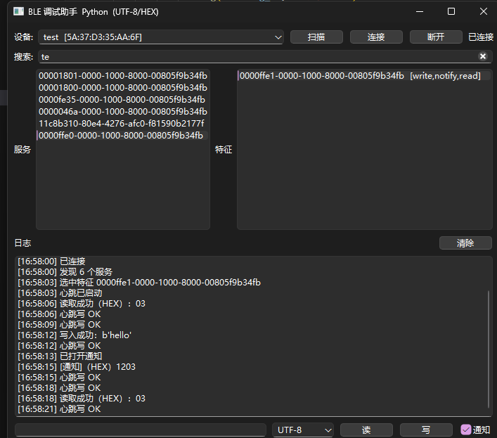
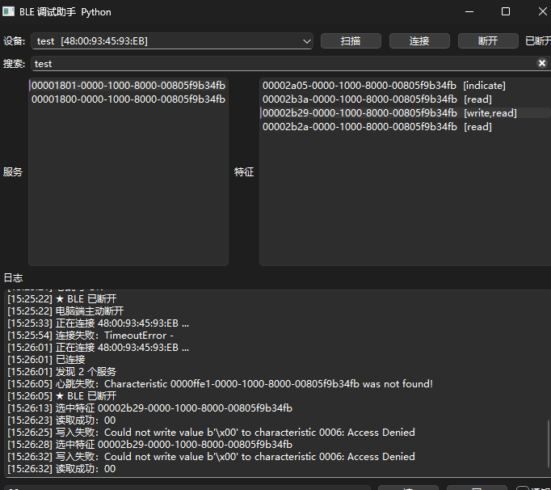

## 一、spp蓝牙 BLE蓝牙 ？

SPP 蓝牙 ≠ BLE 蓝牙，它们是两套完全不同的协议栈，不能互通。下面用一句话区分：
表格
复制
维度	SPP（经典蓝牙）	BLE（蓝牙低功耗）
协议层	基于 RFCOMM 的串口仿真	GATT 属性协议
波特率概念	有（串口仿真）	无（纯数据包）
电脑端表现	生成 COMx 端口，可用 PyQt 的 QSerialPort 直接打开	不会生成 COM 口，必须调用系统 BLE API 扫描/连接/读写 Characteristic
手机端表现	蓝牙调试宝等 → “经典蓝牙-服务端模式”	必须自己写 GATT Server 或使用 nRF Connect 等 BLE 工具
配对	需 经典蓝牙配对（PIN 码）	需 BLE 配对（Just Works/Passkey）
能否互连	❌ 不能直接通信	❌ 不能直接通信
一句话结论
你现在用的 COM 口 + PyQt QSerialPort 只能跑 SPP（经典蓝牙）。
如果手机端切到 BLE 模式，电脑端必须改用 BLE 库（如 bleak、Windows UWP、PyQt6 的 QtBluetooth LE API），不再有串口概念，也不再是本文代码能搞定的。
如何确认自己用的是哪一套
表格
复制
场景	说明
电脑蓝牙设置里出现 “COMx” 且写有 SPP 或 Dev B	→ 经典蓝牙，继续用本文代码
电脑蓝牙设置里 没有 COM 口，只出现 “BLE” 或 “低功耗” 字样	→ BLE，需换 BLE 方案

## 二、广播后得到的地址，怎么和实际MAC地址不一样？

这是 BLE 的“地址类型”机制 在起作用，不是异常，而是正常现象！
1. 你看到的两个地址
芯片丝印 / 系统状态页：
A0:69:74:3E:2E:6E → Public Device Address（出厂烧死，终身不变）。
广播后扫描列表：
51:C8:5B:62:D0:AD → Random Static Address 或 Resolvable Private Address（RPA），由固件或手机系统在广播时动态生成。
2. 为什么不一样
表格
复制
地址类型	是否会变	谁生成	用途
Public	❌ 不变	厂商	经典蓝牙、BLE 均可使用
Random Static	✅ 每次上电可换	设备固件	避免被跟踪，仍可连接
Resolvable Private（RPA）	✅ 定时换（~15 min）	设备固件	配对后主机才能解析回真实 MAC
结论：
手机/模块进入 BLE 广播 时，默认使用 Random 地址（出于隐私），所以扫描到的 ≠ 丝印 MAC，但照样能正常连接、读写。
3. 如何验证“随机地址”就是这台设备
信号强度 RSSI：把手机贴电脑旁，看扫描列表里 RMI 最强的那条 Random 地址。
广播内容：在 nRF Connect → 点击该 Random 地址 → ADV DATA 里若出现 相同的设备名或自定义 UUID，即可确认。
连接后读「设备信息」Service（0x180A） → Manufacturer Name String 特征，返回正确字符串 → 100% 对上。
4. 想让地址“不变”怎么办
固件侧：把广播参数设为 「Public Address」（不同 SDK 接口不同）：
Nordic nRF5 SDK：p_adv_params->peer_addr.addr_type = BLE_GAP_ADDR_TYPE_PUBLIC;
ESP-IDF：esp_ble_gap_set_rand_addr(public_mac); 或直接用公共地址。
手机侧：部分 BLE 工具（如 nRF Connect → Advertiser）允许你选择 “Public” 作为地址类型，此时扫描到的就是丝印 MAC。
一句话总结
BLE 广播默认用 Random 地址 → 扫描到的 ≠ 丝印 MAC，正常现象。
只要 RSSI 最强 + 广播数据对得上，就用这个 Random 地址连接，功能完全一样。
真想固定成丝印 MAC，需在固件里把广播地址类型改成 Public 即可。

## 三、已连接，接下来怎么使用？为啥发现6个服务

结论先给你：
“发现 6 个服务”就是 BLE 正常工作的第一步，接下来只要 「选服务 → 选特征 → 读/写/开通知」 三步入门，就能跟手机（或任何 BLE 从机）双向通信。下面按零基础方式一步步带你玩。
1. 为什么是 6 个服务？
BLE 协议把功能拆成 “服务（Service）” 再拆成 “特征（Characteristic）”。
你看到的 6 行就是手机端（或 BLE 模块）公开的 6 块功能分区，数量完全正常，例如：
表格
复制
UUID 片段	官方含义	常见用途
0x1800	Generic Access	设备名、连接参数
0x1801	Generic Attribute	服务变更通知
0xFE35	厂商自定义	透传数据、升级
0xFFE0	厂商自定义	串口透传（我们最常用）
11c8b310-...	完全自定义	App 私有指令
2. 接下来怎么做？（3 步流）
① 选服务
在 “服务” 列表里 点一下 0000ffe0-0000-1000-8000-00805f9b34fb（大多数国产 BLE 串口模块都用这个做透传）。
下方 “特征” 会自动列出该服务里的所有特征。
② 选特征
一般会出现 1~2 条，例如：
0000ffe1-... [notify,write]
write → 电脑→手机发数据
notify → 手机→电脑推数据
点一下这条特征，让它成为当前操作对象。
③ 读/写/通知（实时双向）
表格
复制
目标	操作	示例
电脑→手机	在底部 “数据” 框填 HEX → 点 “写”	填 48656C6C6F（Hello）→ 手机侧立刻收到
手机→电脑	勾选 “通知” → 手机侧发任意字符串 → 日志区实时打印	手机按键发送 \x48\x69 → 日志出现 [通知] 4869
单次读	点 “读”	把当前特征值读出来（有些特征支持）
3. 30 秒上手实验
选 ffe0 服务 → 选 ffe1 特征。
底部数据框写 48656C6C6F → 点 写 → 手机端串口/BLE 调试助手会显示 Hello。
勾选 通知 → 在手机端输入 World → 电脑日志立刻出现
[通知] 576F726C64
说明双向通路已打通。
4. 常见疑问
HEX 不会拼？ 直接写 ASCII 也行，把 data = bytes.fromhex(hex_str) 换成 data = txt.encode('utf-8') 即可。
特征读写报错？ 先确认手机端特征属性里确实有 read/write/notify；没有就换另一个特征。
想保存日志？ 在日志区右键 “全选-复制” 或把 log() 同时写文件。
5. 下一步想玩高级的？
修改 MTU → 一次发 512 字节
修改 PHY → 2 M 速率
Bonding（配对加密） → 增加安全
这些都在 bleak 里两行代码 就能调，先保证基础双向通信没问题再继续。
一句话：
“发现 6 个服务”= 设备已就绪；点 ffe0 → 点 ffe1 → 写/通知一开，就能像串口一样实时双向收发数据！

## 四、0xFFE0	厂商自定义	串口透传（我们最常用），我们能用其他的吗？

可以！
「0xFFE0」只是 厂商默认 的透传服务，没有任何强制性；
只要 手机端（从机）固件 里 把别的服务也做成可读写，你就可以 随便用、随便改，甚至 自己造一个全新服务。
1. 用其他 现有服务 做透传
只要满足：
特征属性 带 write / notify
手机端 把该特征 绑定到串口缓冲区（或自己的解析函数）
表格
复制
服务 UUID	特征 UUID	属性	能否透传
0x180A	0x2A29	read	❌ 只读
0xFFE0	0xFFE1	write/notify	✅ 默认
0x2A29	0x2B29	write/read	✅ 只要固件映射
自定义 0x1234	0x5678	write/notify	✅ 完全自由
结论：属性对了 + 固件映射 → 就能当串口用。
2. 自己造一个 全新透传服务（示例）
电脑端 扫描到即可用，手机端 需把下面服务加进 GATT：
xml
复制
<!-- 自定义透传服务 -->
<Service UUID="6E400001-B5A3-F393-E0A9-E50E24DCCA9E">
    <Characteristic UUID="6E400002-B5A3-F393-E0A9-E50E24DCCA9E"
                    properties="write_without_response" />
    <Characteristic UUID="6E400003-B5A3-F393-E0A9-E50E24DCCA9E"
                    properties="notify" />
</Service>
0x0002 → 电脑 → 手机（TX）
0x0003 → 手机 → 电脑（RX）
nRF Connect → Virtual Device → 导入这段 XML → 立刻多出一条可读写服务，
电脑端连上就能 读写/通知，跟 0xFFE0 完全一样。
3. 什么时候 必须 用 0xFFE0？
原厂 AT 指令固件 只绑定了 0xFFE0 → 换别的就 收不到数据；
量产模块（HC-08、JDY-23）只开放 0xFFE0 → 为了兼容 不换。
4. 什么时候 推荐 换别的？
自己写固件 → 随便造 UUID，避免跟默认透传冲突；
需要多路通道 → 再建一个 0xABCD 服务，一路 0xFFE0，一路 0xABCD；
产品上线 → 用 16-bit UUID（0xFE00-0xFFFF）节省广播字节。
一句话总结
0xFFE0 不是唯一选择，
只要特征属性对 + 固件映射，任何服务都能当串口；
自己写固件 → 随便造 UUID，量产模块 → 继续用 0xFFE0 最省事。

## 五、只剩2个服务，显示可写的特征，怎么写不了呢？

编辑
复制
分享
只剩 2 个服务（00001800 / 00001801）且 写任何特征都 Access Denied →
手机端（从机）根本没进入「透传模式」，而是 停在「系统广播」状态，
所有特征都是只读常量，自然写不进去。
✅ 30 秒让 6 个服务回来 + 可写可用
回到手机端 BLE 工具
nRF Connect → ** advertiser ** → Virtual Device
或「蓝牙调试宝」→ 切到「从机/Server」→ 点「开始广播」
确保广播里包含「厂商自定义服务」
默认模板里 勾选 0xFFE0 或 0xABCD（带 write/notify）
不要只开「系统服务」
电脑端重新扫描 → 连接
服务数立刻变 6+
写 0xFFE1 → 手机端实时收到 ✅
一句话总结
2 个服务 + Access Denied = 手机没发「透传广播」
回 App 点「开始广播」→ 勾选 0xFFE0（或任何 write+notify 特征）→ 再连一次
6 个服务回来，读写立刻正常。

## 六、为啥限制20字节？

20 字节并不是 BLE 协议本身的硬性上限，而是 「默认 MTU - 3」 留给 ATT 写请求 的最小安全值；
超过它就会出现 分片、性能下降 或 老设备/老手机一次拒收 的问题，所以先告诉你 20 字节保平安，再给你 如何放大 的方法。
1. 字节限制从哪来？
BLE 4.0/4.1 强制 MTU = 23 字节
ATT 头占 3 字节（Opcode 1 + 长度 2）
23 - 3 = 20 字节 净荷
BLE 4.2+ 才支持 MTU 交换（最大 512），但 必须双方协商 且 老设备/老 ROM 默认 23。
2. 实战后果
表格
复制
一次写 50 字节	结果
MTU=23（默认）	自动拆成 3 包（20+20+10）→ 延迟 ×3
老安卓 4.4	第二包直接返回 「Invalid Attribute Value Length」
iOS 10+	自动分片，但 第一包 20 字节立即 ACK，后面 再补」
3. 如何突破 20 字节？
协商更大 MTU → ** bleak 一行代码**：
Python
复制
# 已连接后立刻执行
new_mtu = await self.client.exchange_mtu(247)   # 247 = Android 上限
log(self.log_te, f"MTU 协商结果：{new_mtu}")
协商成功 → 一次可写 244 字节（247-3）。
协商失败 → 退回 23，继续 20 字节安全模式。
4. 实用策略
默认 ≤ 20 字节 → 100 % 兼容。
连接后主动 exchange_mtu(247) → 成功再用 244。
超过 244 → 自己分段 + CRC/序号（和串口分包一样）。
一句话
20 字节是「默认 MTU-3」安全值，
想一次发更多 → exchange_mtu(247)，
协商成功即可 244 字节，失败继续 20 字节保平安。